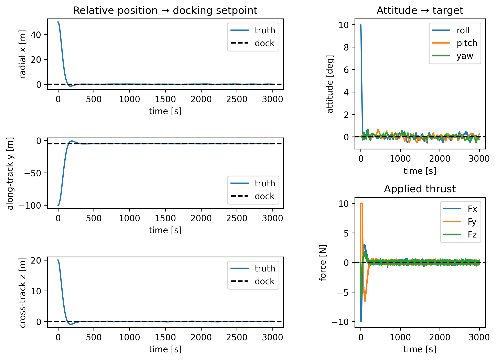
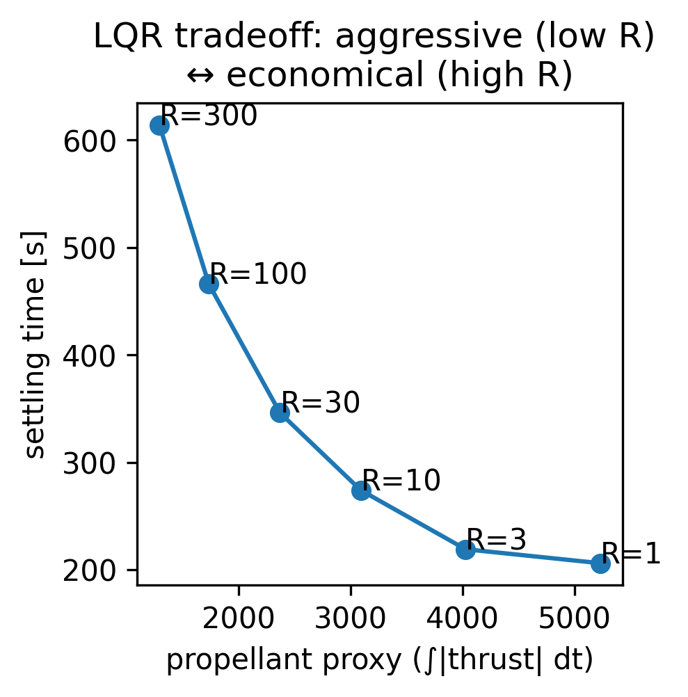
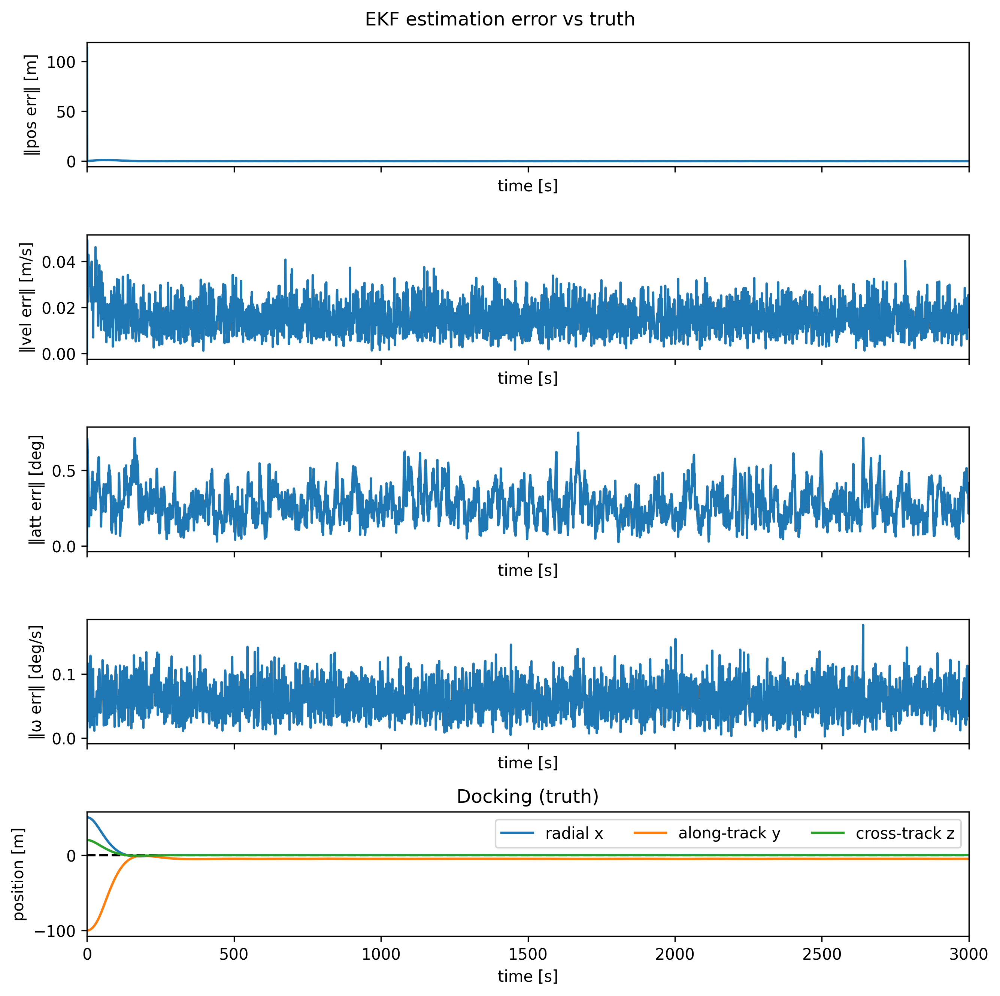
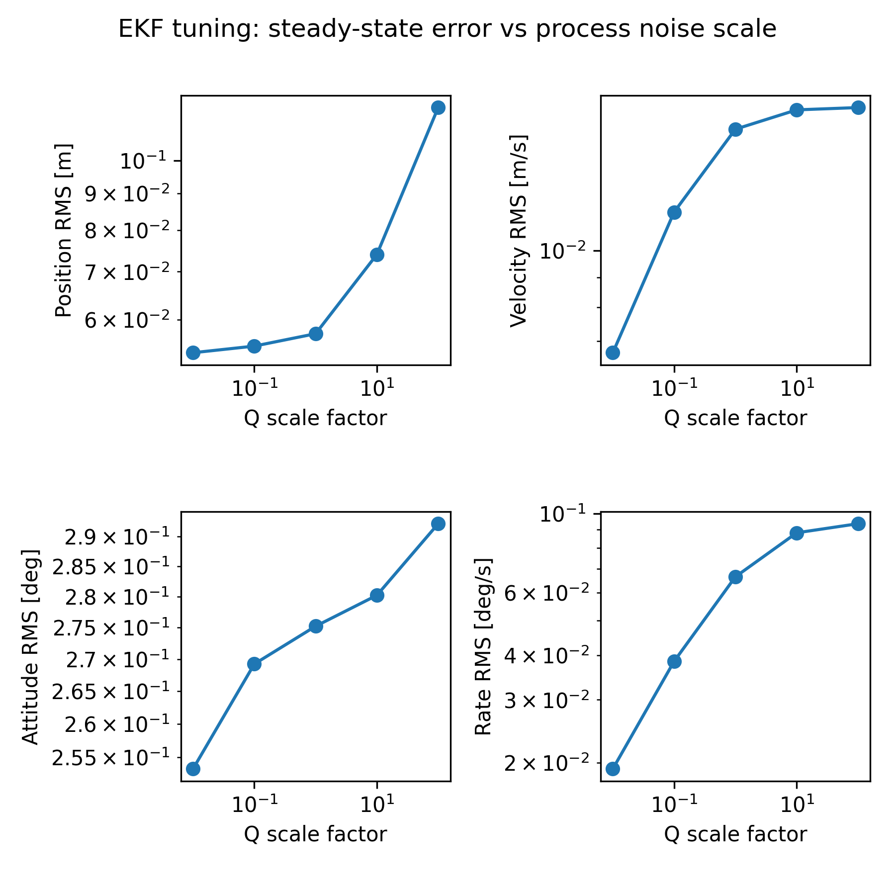
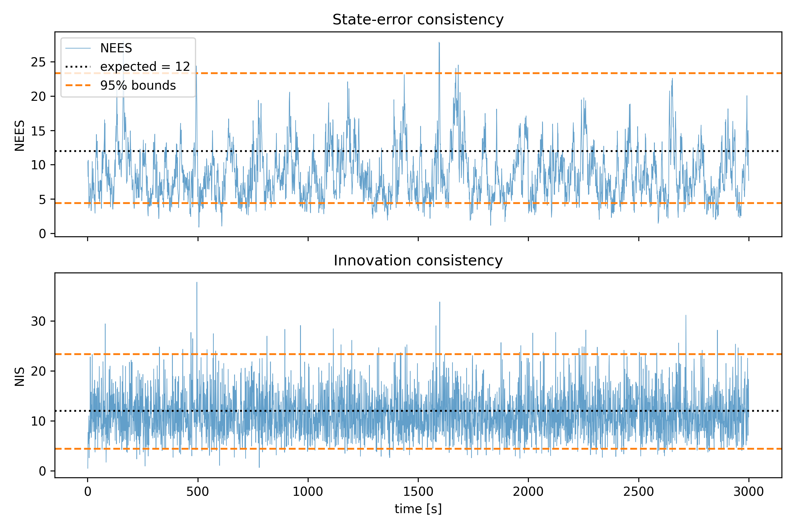
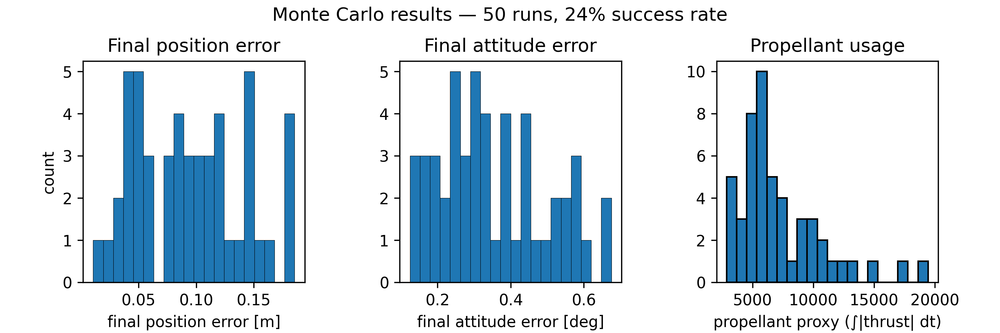
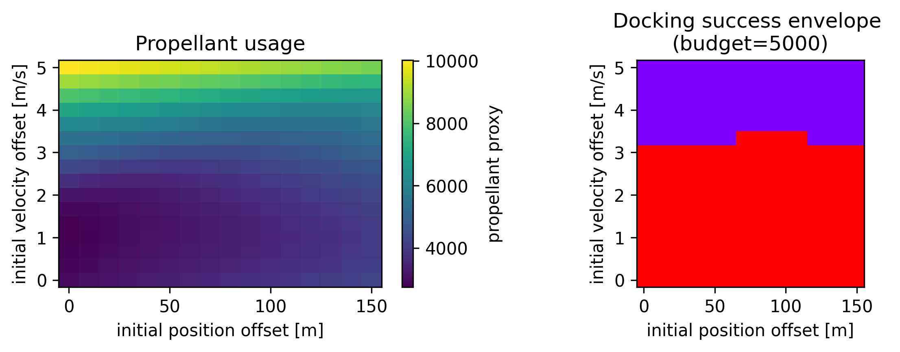
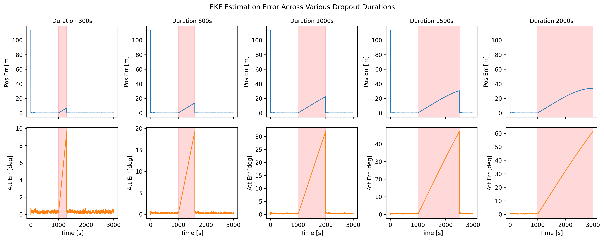
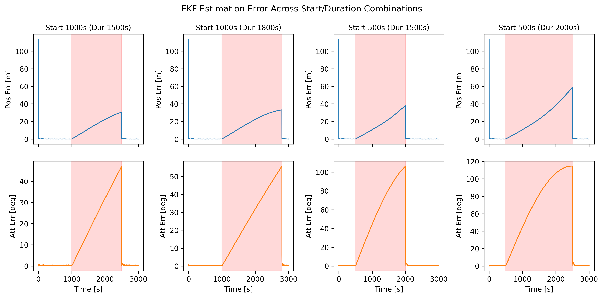

### 1. Closed-Loop Docking (Nominal)
The 6-DOF closed loop successfully performs autonomous lunar-orbit rendezvous
and docking. From an initial 100 m relative offset with 10° attitude error,
the LQR controller drives relative position to the docking setpoint
([0, −5, 0] m, Hill frame) and attitude to alignment, with commanded thrust
decaying to zero at steady state — confirming convergence.

### 2. LQR Tuning
The LQR control-weight matrix R was swept across two orders of magnitude to
characterize the convergence-vs-propellant tradeoff. Low R yields aggressive
maneuvers that saturate thrusters and consume more propellant; high R conserves
propellant at the cost of slower convergence. R = 10 was selected as the
operating point that docks without sustained thruster saturation.

### 3. MEKF Navigation
A Multiplicative Extended Kalman Filter (MEKF) estimates the full 6-DOF
relative state from noisy measurements, using a 12-dimensional error state
with a 3-parameter small-angle attitude error (avoiding the singular
covariance a 4-component quaternion would produce; attitude corrections are
injected multiplicatively).

Steady-state estimation error, decomposed into signed components, confirms an
unbiased filter that reduces noise below the sensor floor:

| Channel | Bias (mean) | Std (1σ) | Sensor 1σ | \|mean\|/std |
|---|---|---|---|---|
| Position [m] | ≤ 0.004 | 0.033 | 0.10 | ≤ 0.13 |
| Velocity [m/s] | ≤ 4e-5 | 0.009 | 0.01 | ≤ 0.004 |
| Attitude [deg] | ≤ 0.030 | 0.16 | 0.50 | ≤ 0.21 |
| Rate [deg/s] | ≤ 0.0023 | 0.038 | 0.05 | ≤ 0.06 |

All |mean|/std values are well below 0.3, confirming no systematic bias.
Position error (0.033 m) and attitude error (0.16°) are reduced ~3× relative
to raw sensor noise (0.10 m, 0.50°).

### 4. EKF Tuning
The process-noise scale was swept across four orders of magnitude. Steady-state
error increased monotonically with the scale factor; q_scale = 0.01 was
selected as the operating point, and the filter remained stable across the
entire sweep.

| Q scale | Pos RMS [m] | Vel RMS [m/s] | Att RMS [deg] | Rate RMS [deg/s] |
|---------|-------------|---------------|---------------|------------------|
| 0.01    | 0.054       | 0.0067        | 0.249         | 0.0194           |
| 0.10    | 0.055       | 0.0116        | 0.268         | 0.0381           |
| 1.00    | 0.057       | 0.0162        | 0.275         | 0.0656           |
| 10.0    | 0.074       | 0.0174        | 0.279         | 0.0877           |
| 100.0   | 0.119       | 0.0176        | 0.286         | 0.0931           |

### 5. Filter Consistency (NEES / NIS)
Filter consistency was validated against chi-squared bounds (error-state
dimension = 12):
- **NIS mean = 11.39** (expected 12), with 95.2% of samples inside the 95%
  confidence interval, confirming the measurement-noise model R is well-tuned.
- **NEES mean = 8.17** (expected 12), with 86.6% of samples inside the 95% CI, 
  indicating mild underconfidence: the filter's claimed uncertainty is
  conservatively larger than its actual error.

### 6. Monte Carlo Robustness
A 50-run Monte Carlo simulation applied dispersed initial conditions (±50 m
position, ±2 m/s velocity, ±30° attitude, ±1°/s rate) with independent sensor
noise seeds.

- **Nominal (no constraint):** 100% docking success. Final position
  error averaged 0.095 m (95th percentile 0.181 m, max 0.186 m); final attitude
  error averaged 0.354° (95th percentile 0.603°, max 0.675°).
- **Propellant-constrained (5000-unit budget):** success dropped to **24.0%**.
  Propellant use averaged 7309 (max 19447) and thruster saturation reached
  30.9% in the worst runs. Critically, final position/attitude errors remained
  nominal in all runs — every failure was propellant exhaustion, not loss of
  convergence. This isolates propellant and control authority (not stability or
  estimation) as the bottleneck.

### 7. Robustness Envelope
To identify *which* initial conditions are recoverable (complementing the
statistical MC view), an 8×8 grid over initial position and velocity
offsets was mapped against the 5000-unit propellant budget,
yielding an overall recoverable fraction of **70.3%**.

- **Propellant is dominated by initial velocity offset**, not position:
  consumption ranged from **2152** (near-zero velocity) to **9491** (5 m/s
  velocity offset), with only weak dependence on position offset.
- **Velocity is the dominating factor.** All initial velocity offsets
  **≤ 3.57 m/s** dock successfully within budget across the full tested
  position range (0–150 m); at **4.29 m/s and above, no position offset
  succeeds**, the spacecraft always exhausts its propellant killing the
  initial velocity.
- **Non-monotonic in position.** The maximum recoverable velocity
  *increases* with position offset: at small offsets (<50 m) the limit is
  **2.86 m/s**, rising to **3.57 m/s** for larger offsets. Larger along-track
  offsets thus tolerate higher initial velocity, a counterintuitive result
  reflecting the coupled position–velocity structure of CW relative motion.

#This envelope defines an effective approach corridor: the region of initial
#relative states (roughly, initial velocity ≲ 3 m/s at close range, ≲ 3.6 m/s
#farther out) from which autonomous docking succeeds within the fuel budget.

### 8. Off-Nominal: Sensor Dropout
Measurement dropouts were injected mid-approach to test navigation resilience.
During each outage the MEKF ran predict-only, propagating on the CW/attitude
dynamics with no measurement correction, so its uncertainty (covariance) grew.
A duration sweep showed the filter coasts through outages and recovers to
nominal error once measurements resume: for dropouts from 300 s up to 2000 s
(with recovery time available), final docking error stayed within ~0.5 m and
~0.6°, and docking succeeded in every case. As an example, a 300 s dropout let
estimation error drift from its ~0.03 m / ~0.16° nominal level to a peak of
2.52 m / 5.87° during the outage, then snap back to nominal (0.044 m / 0.503°)
after measurements returned.

The sweep also caught a subtle test artifact. An early run showed a 2000 s
dropout failing badly (14.6 m, 37° final error), but that dropout ran to the
very end of the docking window, so measurements never came back before docking.
Re-running the same 2000 s dropout earlier, so measurements resumed with time to
spare, docked cleanly (0.045 m, 0.048°). So the real limit isn't how long the
filter can coast, it's whether measurements return early enough to re-converge
before docking. This distinction only showed up because the first-pass result
was double-checked rather than taken at face value.

